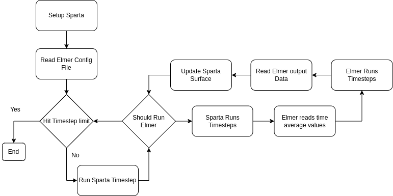

 Sparta + Elmer

 <h3>Marek Brodke and Khare Prashant</h3>

---

# What each do Separately

__Sparta__:
- Simulates particles, making it excellent for rarefied flow.
- Simulate particle interactions with a solid surface.
- Can find forces and energy fluxes across a surface and its elements.

__Elmer__:
- Simulates solid body mechanics (i.e. deformation and heating).
- Can also simulate continuum flows, electro-dynamics, radiation, and more.

---

# What they do Together
By coupling Sparta with Elmer it is now possible to:
- Use particle interactions with a surface to find heating and deformation.
- Dynamically update surface mesh in both Sparta and Elmer to accommodate the results of heating and deformation.

---
# Diagram of the Operation

</img>

